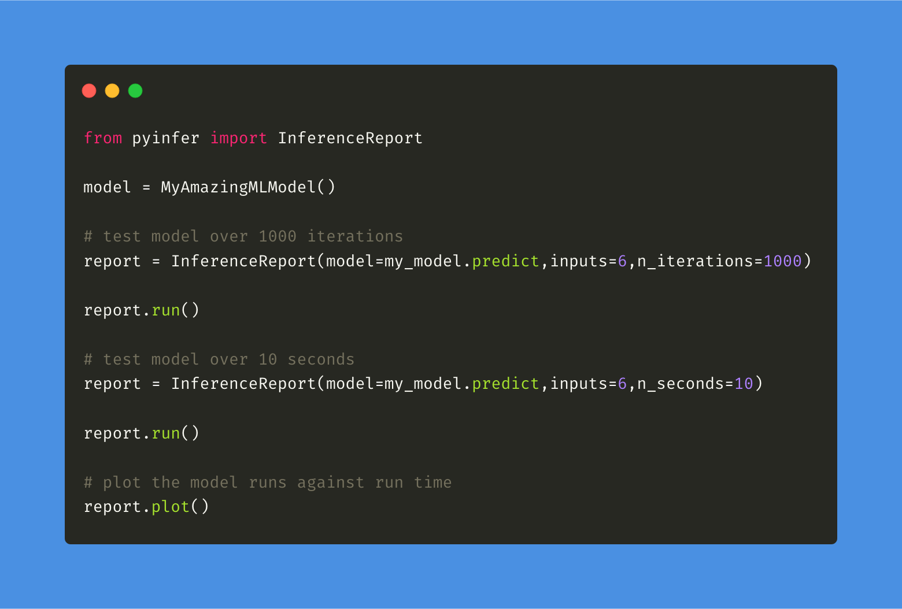
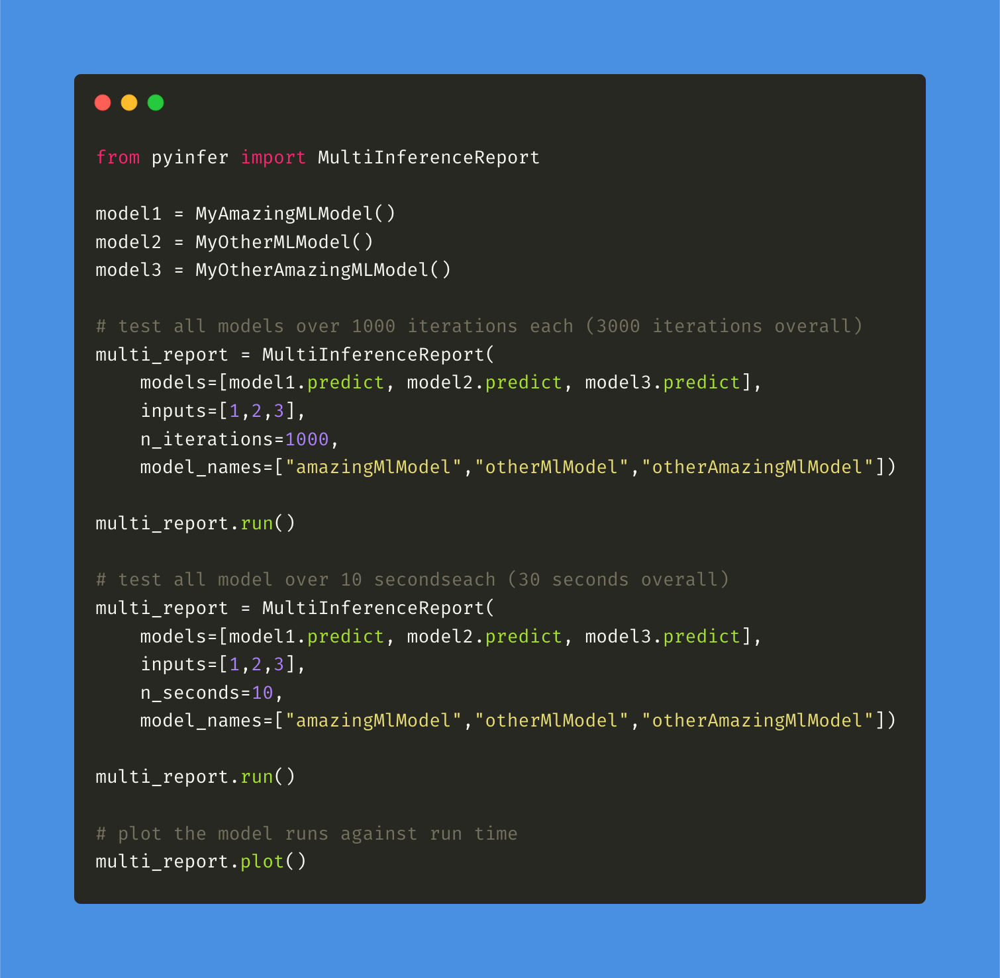
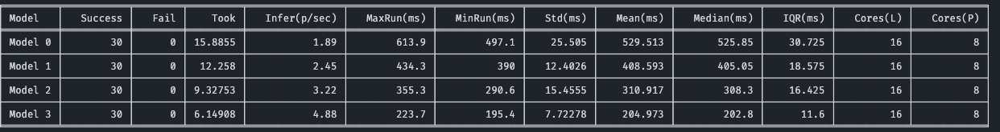
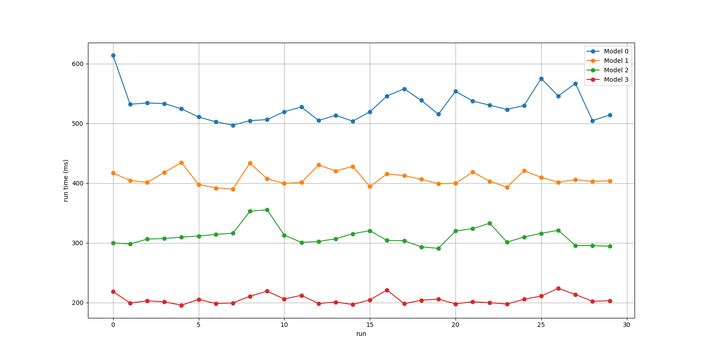

<p align="center">
    <a id="pyinfer" href="#pyinfer">
        
    </a>
</p>

[](https://app.circleci.com/pipelines/github/cdpierse/pyinfer)

[](https://pyinfer.readthedocs.io)

Pyinfer is a model agnostic tool for ML developers and researchers to benchmark the inference statistics for machine learning models or functions.

## Installation

```python
pip install pyinfer
```

## Overview

### Inference Report

`InferenceReport` is for reporting inference statistics on a single model artifact. To create a valid report simply pass it a callable model function or method, valid input(s), and either **n_iterations** or **n_seconds** to determine what interval the report uses for its run duration. Check out the docs for more information on the optional parameters that can be passed. 
<p align="left">
    <a id="pyinfer" href="#pyinfer">
        
    </a>
</p>

### Multi Inference Report

`MultiInferenceReport` is for reporting inference statistics on a list of model artifacts. To create a valid multi report pass it a list of callable model functions or methods, a list of valid input(s), and either **n_iterations** or **n_seconds** to determine what interval the report uses for its run duration. Check out the docs for more information on the optional parameters that can be passed.

<p align="left">
    <a id="pyinfer" href="#pyinfer">
        
    </a>
</p>


### Example Outputs

**Table Report**
<p align="left">
    <a id="pyinfer" href="#pyinfer">
        
    </a>
</p>

**Run Plot**
<p align="left">
    <a id="pyinfer" href="#pyinfer">
        
    </a>
</p>

### Stats Currently Included

- Success Rate - Number of successful inferences within a specified time range.
- Failures - Number of inferences above specified time range.
- Time Taken - Total time taken to run all inferences.
- Inference Per Second - Estimate of how many inferences per second the selected model can perform.
- Max Run - The max time taken to perform an inference for a given run.
- Min Run - The min time taken to perform an inference for a given run.
- Std - The Standard deviation between runs.
- Mean - The mean run time.
- Median - The median run time.
- IQR - The inter quartile range of the runs.
- Cores Logical - The number of logical cores on the host machine.
- Cores Physical - The number of physical Cores on the host machine.

### Planned Future Stats

- Model Size - Information relating to the size of the model in bytes. 
- GPU Stat Support - Information about if GPU is available and if it is being utilized.
