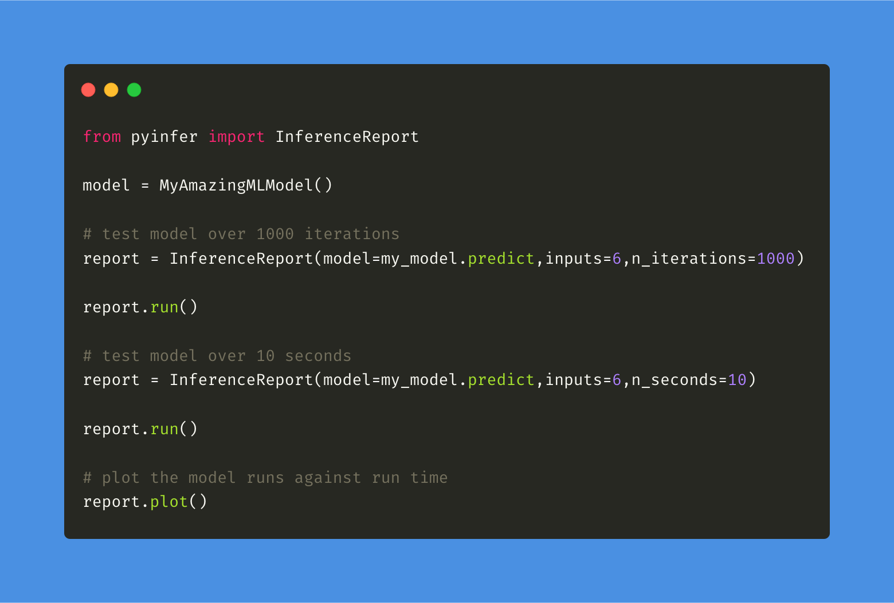

Pyinfer
===================================

Pyinfer is a model agnostic tool for ML developers and researchers to benchmark the inference statistics for machine learning models or functions.

`Find Pyinfer on Github <https://github.com/cdpierse/pyinfer>`_

Installation
============
.. code-block:: python

    pip install pyinfer

Overview
========

**Inference Report**

:code:`InferenceReport` is for reporting inference statistics on a single model artifact. To create a valid report simply pass it a callable model function or method, valid input(s), and either **n_iterations** or **n_seconds** to determine what interval the report uses for its run duration. Check out the docs for more information on the optional parameters that can be passed. 

**Multi Inference Report**

:code:`MultiInferenceReport` is for reporting inference statistics on a list of model artifacts. To create a valid multi report pass it a list of callable model functions or methods, a list of valid input(s), and either **n_iterations** or **n_seconds** to determine what interval the report uses for its run duration. Check out the docs for more information on the optional parameters that can be passed.

.. toctree::
   :maxdepth: 2
   :caption: Contents:
   
   inference_report.rst
   multi_inference_report.rst

Indices and tables
==================

* :ref:`genindex`
* :ref:`modindex`
* :ref:`search` 
